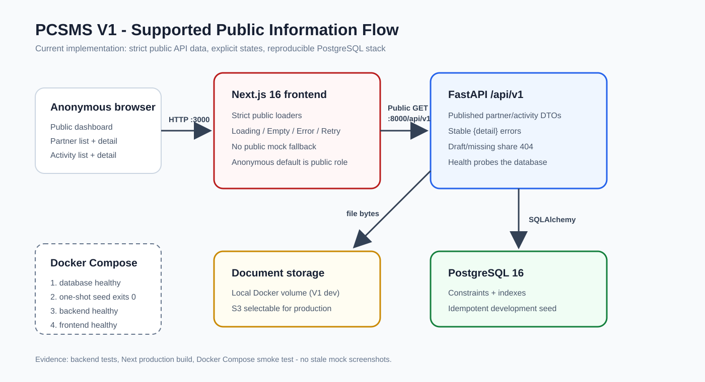

# สถาปัตยกรรม V1

## ระบบที่รองรับ

V1 เป็นระบบข้อมูลสาธารณะสามชั้น ผู้ใช้ทั่วไปดูได้เฉพาะหน่วยงานคู่ความร่วมมือ
และกิจกรรมที่เผยแพร่แล้วผ่าน Next.js โดย FastAPI เป็นขอบเขตบังคับใช้สัญญา API
และสถานะเผยแพร่ ส่วน PostgreSQL จัดเก็บข้อมูลเชิงสัมพันธ์ ไฟล์เอกสารในเครื่อง
อยู่ใน Docker volume และ production สามารถเลือก S3 ได้



```text
Browser
  | HTTP :3000                         public GET /api/v1 :8000
  v                                               |
Next.js 16 (App Router, โหลดข้อมูลฝั่ง client) ---+
  | - dashboard และหน้า list/detail สาธารณะ
  | - loading / empty / error / retry ชัดเจน
  | - public flow ที่รองรับไม่ fallback เป็น mock
  v
FastAPI + Pydantic DTOs
  | - error คงรูป {"detail": ...}
  | - บังคับ is_published ทั้ง list, detail และ partner ที่ซ้อนใน activity
  | - health จะผ่านต่อเมื่อ query ฐานข้อมูลสำเร็จ
  +---------------- SQLAlchemy ----------------> PostgreSQL 16
  +---------------- storage abstraction ------> local volume | S3
```

Docker Compose สร้าง `database`, `seed` แบบ one-shot ที่รันซ้ำได้, `backend`
และ `frontend` ตามลำดับ dependency ส่วน browser เรียก `PUBLIC_API_URL` ที่เข้า
ถึงได้จาก host ขณะที่ container สื่อสารผ่าน network แยกของ Compose และเปิด
database port เฉพาะ `127.0.0.1`

## ชั้นระบบและหน้าที่

| ชั้น | เทคโนโลยี | หน้าที่ |
|---|---|---|
| Frontend | Next.js 16.3.4, React 18, TypeScript, Tailwind | เมนูและหน้าสาธารณะ โดย loader ของ partner/activity มีสถานะ loading, success, empty และ error แบบชัดเจน |
| API | FastAPI, Pydantic v2 | REST `/api/v1`, แยก DTO จาก ORM, กรองสถานะเผยแพร่ และคงรูปแบบ error |
| Persistence | SQLAlchemy, PostgreSQL 16 | ข้อมูล partner, activity, document และตารางลูก พร้อม constraints, indexes และกฎลบ foreign key |
| Object storage | local volume หรือ S3 | เก็บ bytes ของเอกสาร ส่วน PostgreSQL เก็บ metadata และ storage key |
| Verification | pytest, Compose smoke test, Next production build | ทดสอบ API/schema แบบแยกข้อมูล และเส้นทาง integration ตั้งแต่ database ถึง frontend |

## การตัดสินใจสำคัญ

1. **API เป็นขอบเขตการเผยแพร่** - list/detail กรอง `is_published` และ activity
   ที่เผยแพร่แล้วต้องไม่เผย partner ฉบับร่างผ่านข้อมูลซ้อน ID ที่ไม่มีหรือยังไม่
   เผยแพร่คืน 404 รูปแบบเดียวกัน ไม่เลือกวิธีซ่อนเพียงลิงก์ใน UI เพราะผู้เรียก API
   สามารถข้าม UI ได้
2. **Public route แสดงความล้มเหลวตรงไปตรงมา** - หน้า partner/activity และ public
   dashboard เริ่มจาก loading, อธิบายกรณีว่าง และให้ retry เมื่อ error การ fallback
   เป็น mock แบบเดิมคงไว้เฉพาะหน้าต้นแบบนอก public flow เพราะถ้าใช้ในหน้าสาธารณะ
   จะซ่อน API failure และอาจทำให้เข้าใจสถานะเผยแพร่ผิด
3. **สภาพแวดล้อม local รวมฐานข้อมูล** - Compose ใช้ PostgreSQL 16 และ seed
   one-shot แทนการพึ่งฐานข้อมูล `localhost` ที่ไม่ได้จัดเตรียมไว้ พร้อม health-based
   dependencies เพื่อให้ลำดับเริ่มระบบแน่นอน
4. **Schema และ seed รันซ้ำได้** - model ระบุ natural keys, domain checks,
   indexes, relationships และ delete behavior ส่วน seed เป็นแบบ additive และ
   idempotent โดย `create_all` ใช้สำหรับ clean V1 setup; migration production อยู่
   นอกขอบเขต V1
5. **Tests แยกข้อมูลจากกัน** - API tests override database dependency ด้วย
   in-memory SQLite ใหม่ที่ใช้ `StaticPool`; schema/seed tests ใช้ฐานชั่วคราวของตน
   จึงไม่ขึ้นกับลำดับการรัน
6. **ที่อยู่สำหรับ browser กับ server แยกกัน** - browser resolve ชื่อ service ของ
   Compose ไม่ได้ จึงฝัง `PUBLIC_API_URL` ที่ host เข้าถึงได้ ส่วน backend/database
   สื่อสารบน Compose network

## เส้นทางคำขอสาธารณะ

```text
ผู้ใช้ทั่วไป
  -> /stakeholders, /stakeholders/{id}, /activities, /activities/{id}
  -> strict loader ใน frontend/src/lib/api.ts
  -> GET /api/v1/partners[/id] หรือ /activities[/id]
  -> FastAPI กรอง is_published และแปลง ORM เป็น DTO
  -> PostgreSQL
  -> ข้อมูลสำเร็จ | list ว่าง | 404/error ที่คงรูป
  -> frontend แสดง success | empty | error พร้อม retry
```

## ขอบเขต V1

- รองรับ: public dashboard, partner/activity list และ detail ที่เผยแพร่แล้ว,
  full stack ในเครื่องที่สร้างซ้ำได้ และหลักฐาน API/schema/security
- มีอยู่แต่ไม่ใช่ผลลัพธ์สาธารณะนี้: การจัดการเอกสารและหน้าต้นแบบตาม role สำหรับ
  feedback, exchange, reports, settings และ users
- authentication, authorization และ partner/activity write workflow เป็น V2+

ดูการเชื่อมโยงผลลัพธ์กับโค้ดและ tests ใน
[ดัชนีหลักฐาน V1](../evidence/v1-readiness.md)
